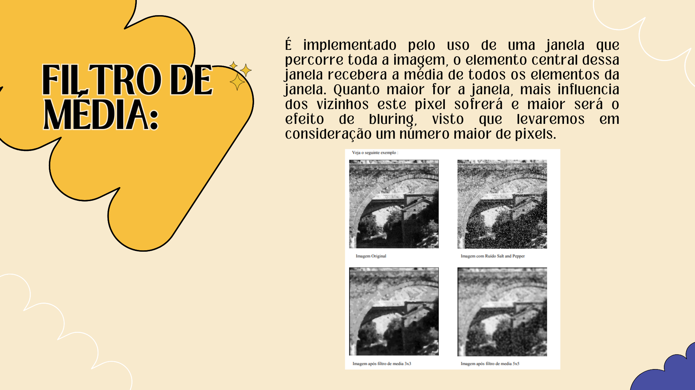

# Remoção de Ruídos

- **O que é um ruído?**
O ruído é caracterizado como uma variação dos valores nos níveis de cinza dos pixels da imagem, causados por erros na transmisssão de dados ou eventuais distorção introduzida na fase de aquisição de uma imagem em geral.
- **O que é filtro de suavização?** Os filtros de suavização tem o objetivo de processar uma imagem de modo que o resultado seja mais apropriado do que a imagem original, mas as técnicas de realce podem enfatizar as bordas e outros detalhes da imagem e as imperfeições da imagem também.

Foi escolhido o filtro mediana no código para fazer a demonstração do código porque reduzem o bluring e preserva a edging. O pixel é substituído pelo valor médio de seus vizinhos, caso o tamanho da sua janela seja par, então o valor da mediana será a média dos dois valores centrais, além disso esse filtro pode ser considerado um dos melhores porque preserva o cotorno.
Mas, em gerl, os filtros de mediana permite que partes dos detalhes que possuem altas frequências espaciais da imagem que passem, ao mesmo tempo que é muito efetivo na remoção de ruídos onde menos da metade dos vizinhos tenham sido modificados pelo ruído.

## Escolha da biblioteca OPENCV
A biblioteca OpenCV começou na Intel por volta de 1999 e foi lançada a sua primeira versão em 200. Atualmente, essa biblioteca oferece suporte a uma ampla variedade de linguagens de programação como C++, Python, Java e entre outros e está disponível em diferentes plataformas, incluindo Windows, Linux, OS X, Androind e entre outros.

## Resultado do código
O resultado está sendo exibido na imagem abaixo onde o filtro usado foi o **filro mediana**.

## Apresentação do Projeto
A apresentação do projeto na disciplina de Computação Gráfica foi dividida nos seguintes tópicos:
- **Introdução:** é uma breve descrição do que será apresentado.
- **Integrantes:** quais foram os integrantes do grupo para apresentar o projeto.
- **O que são ruídos?:** é uma breve descrição sobre o que são ruídos.
- **O que é um filtro de suavização?:** é uma breve descrição sobre filtro de suavização.
- **Filtro de média:** explicação sobre o que é filtro de média.
- **Filtro de mediana:** explicação sobre o que é filtro de mediana.
- **Código do projeto:** contém informações sobre o código do projeto apresentado e pode ser localizado no repositório.

## Apresentando a introdução

## Apresentando o que são ruidos

## Apresentando o que é um filtro de suavização

## Apresentando o filtro de média

## Apresentando o filtro de mediana

## Apresentando o código do projeto

